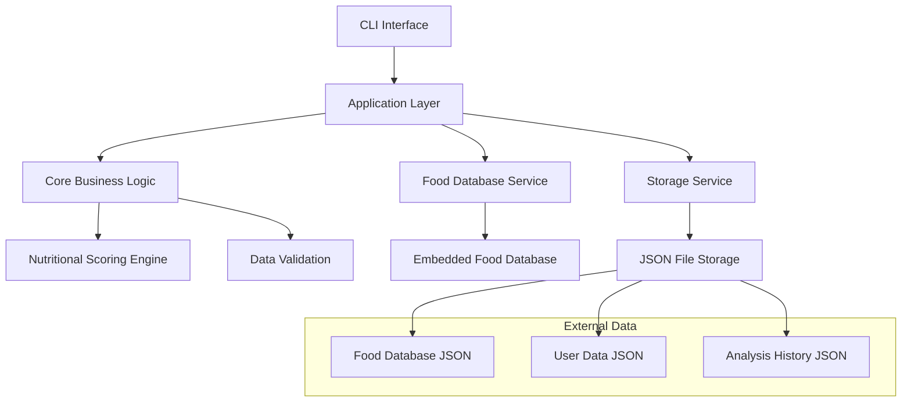
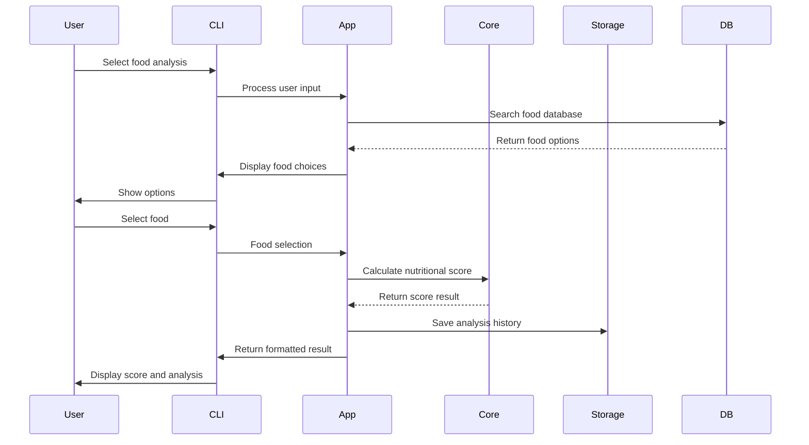

# Design Document

## Overview

The enhanced nutritional score calculator will be built as a modular Go application with a clean architecture that separates concerns between data storage, business logic, and user interfaces. The design maintains the existing core scoring functionality while adding comprehensive features for food database management, data persistence, user interface improvements, and analysis capabilities.

The application will follow a layered architecture pattern with clear separation between the presentation layer (CLI interface), business logic layer (scoring algorithms and food management), and data access layer (file-based storage and embedded food database).

## Architecture

### High-Level Architecture



### Component Interaction Flow



## Components and Interfaces

### 1. Core Nutritional Scoring Engine

**Purpose:** Handles all nutritional score calculations with accurate Nutri-Score algorithm implementation.

**Key Components:**
- `NutritionalScorer` - Main scoring engine
- `ScoreCalculator` - Algorithm implementation for different food types
- `NutritionalValidator` - Input validation and range checking

**Interfaces:**
```go
type NutritionalScorer interface {
    CalculateScore(data NutritionalData, foodType ScoreType) (NutritionalScore, error)
    ValidateNutritionalData(data NutritionalData) error
    GetScoreGrade(score int) string
}

type ScoreCalculator interface {
    CalculateNegativePoints(data NutritionalData) int
    CalculatePositivePoints(data NutritionalData, foodType ScoreType) int
    GetFinalScore(negative, positive int, foodType ScoreType) int
}
```

### 2. Food Database Service

**Purpose:** Manages access to embedded food database and user-saved foods.

**Key Components:**
- `FoodDatabaseManager` - Handles database operations
- `FoodSearchEngine` - Implements food search functionality
- `FoodRepository` - Data access abstraction

**Interfaces:**
```go
type FoodDatabase interface {
    SearchFoods(query string) ([]Food, error)
    GetFoodByID(id string) (Food, error)
    GetAllFoods() ([]Food, error)
}

type UserFoodRepository interface {
    SaveFood(food Food) error
    GetUserFoods() ([]Food, error)
    UpdateFood(id string, food Food) error
    DeleteFood(id string) error
}
```

### 3. Storage Service

**Purpose:** Handles all data persistence operations using JSON file storage.

**Key Components:**
- `JSONStorage` - File-based storage implementation
- `HistoryManager` - Analysis history management
- `DataExporter` - Export functionality

**Interfaces:**
```go
type StorageService interface {
    SaveAnalysis(analysis NutritionalAnalysis) error
    GetAnalysisHistory(filter HistoryFilter) ([]NutritionalAnalysis, error)
    ExportData(format ExportFormat, data interface{}) ([]byte, error)
}
```

### 4. CLI Interface Layer

**Purpose:** Provides user-friendly command-line interface with menu-driven navigation.

**Key Components:**
- `MenuSystem` - Interactive menu handling
- `InputHandler` - User input processing and validation
- `OutputFormatter` - Result display formatting

**Interfaces:**
```go
type CLIInterface interface {
    ShowMainMenu() MenuChoice
    GetNutritionalInput() (NutritionalData, error)
    DisplayScore(result NutritionalAnalysis)
    ShowFoodList(foods []Food) (Food, error)
}
```

## Data Models

### Enhanced Data Models

```go
// Core nutritional data structure (enhanced from existing)
type NutritionalData struct {
    Energy              EnergyKJ            `json:"energy"`
    Sugars              SugarGram           `json:"sugars"`
    SaturatedFattyAcids SaturatedFattyAcids `json:"saturated_fatty_acids"`
    Sodium              SodiumMilligram     `json:"sodium"`
    Fruits              FruitsPercent       `json:"fruits"`
    Fibre               FibreGram           `json:"fibre"`
    Protein             ProteinGram         `json:"protein"`
}

// Enhanced nutritional score with grade
type NutritionalScore struct {
    Value     int       `json:"value"`
    Grade     string    `json:"grade"`     // A, B, C, D, E
    Positive  int       `json:"positive"`
    Negative  int       `json:"negative"`
    ScoreType ScoreType `json:"score_type"`
}

// Food item structure
type Food struct {
    ID               string          `json:"id"`
    Name             string          `json:"name"`
    Category         string          `json:"category"`
    NutritionalData  NutritionalData `json:"nutritional_data"`
    IsUserDefined    bool            `json:"is_user_defined"`
    CreatedAt        time.Time       `json:"created_at"`
}

// Analysis result with metadata
type NutritionalAnalysis struct {
    ID              string           `json:"id"`
    Food            Food             `json:"food"`
    Score           NutritionalScore `json:"score"`
    AnalyzedAt      time.Time        `json:"analyzed_at"`
    Notes           string           `json:"notes,omitempty"`
}

// Comparison result
type FoodComparison struct {
    Foods           []Food                `json:"foods"`
    Analyses        []NutritionalAnalysis `json:"analyses"`
    BestChoice      *Food                 `json:"best_choice,omitempty"`
    ComparedAt      time.Time             `json:"compared_at"`
}
```

### Storage Schema

**File Structure:**
```
data/
├── foods_database.json      # Embedded food database
├── user_foods.json          # User-saved foods
├── analysis_history.json    # Historical analyses
└── exports/                 # Export directory
    ├── analysis_export.json
    └── analysis_export.csv
```

## Error Handling

### Error Types and Handling Strategy

```go
type NutritionalError struct {
    Type    ErrorType `json:"type"`
    Message string    `json:"message"`
    Field   string    `json:"field,omitempty"`
}

type ErrorType string

const (
    ValidationError ErrorType = "validation"
    StorageError    ErrorType = "storage"
    DatabaseError   ErrorType = "database"
    CalculationError ErrorType = "calculation"
)
```

**Error Handling Principles:**
- All user inputs are validated with clear error messages
- Storage operations include retry logic for transient failures
- Calculation errors are logged and user-friendly messages displayed
- Database errors fall back to user-defined foods when possible

## Testing Strategy

### Unit Testing Approach

**Core Components Testing:**
- `NutritionalScorer` - Test all scoring algorithms with edge cases
- `FoodDatabase` - Test search functionality and data retrieval
- `StorageService` - Test file operations and data persistence
- `InputValidator` - Test all validation rules and error cases

**Test Data Strategy:**
- Use realistic nutritional data for testing
- Include edge cases (zero values, maximum values)
- Test different food types and scoring scenarios
- Mock external dependencies for isolated testing

**Integration Testing:**
- End-to-end CLI workflow testing
- Database and storage integration testing
- Export functionality testing

### Test Structure

```go
// Example test structure
func TestNutritionalScorer_CalculateScore(t *testing.T) {
    tests := []struct {
        name     string
        data     NutritionalData
        foodType ScoreType
        expected NutritionalScore
        wantErr  bool
    }{
        // Test cases for different scenarios
    }
}
```

## Implementation Considerations

### Performance Optimizations
- Lazy loading of food database
- Caching frequently accessed foods
- Efficient JSON parsing for large datasets
- Minimal memory footprint for CLI application

### Extensibility Features
- Plugin architecture for additional scoring algorithms
- Configurable scoring thresholds
- Support for additional nutritional metrics
- API-ready design for future web interface

### Data Migration Strategy
- Backward compatibility with existing data structures
- Automatic migration of user data on version updates
- Validation of migrated data integrity

### Security Considerations
- Input sanitization for all user data
- Safe file operations with proper error handling
- No sensitive data storage (all nutritional data is public)
- Validation of export file paths to prevent directory traversal